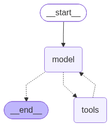

# Code Reader Agent

Read-only Q&A agent over a directory of code.

Given a root directory and a user question, the agent explores the directory with
nine tools and answers based only on what it reads -- it never executes, runs, or
tests any code.

Graph (`agent.py`):



`create_code_reader_agent` hands its tools to `langchain.agents.create_agent`,
which compiles them into a standard ReAct loop (model node <-> tools node)
rather than a hand-wired graph -- there's no bespoke control flow to diagram
beyond "call tools until the model has enough to answer."

Tools (all scoped to the given root directory, in `tools/`):

- `list_directory` -- ASCII tree of files/folders (wraps `list_directory_func.print_tree`)
- `read_file` -- reads a single file's text content
- `search_in_files` -- regex search across files, returns `path:line: text` hits
- six more from `tools/mcp_code_extractor.py`, proxied over MCP from the vendored
  `third_party/mcp_servers/mcp_server_code_extractor` server: `get_symbols_tool`,
  `get_function_tool`, `get_class_tool`, `get_lines_tool`, `get_signature_tool`,
  `search_code_tool` -- each wrapped so its path/scope argument is resolved
  through the same `resolve_within_root` boundary as the other three, with
  `://`-URLs and `git@`-style refs rejected outright (the upstream server can
  otherwise fetch from GitHub/GitLab) and `search_code_tool`'s `follow_symlinks`
  forced to `False` regardless of what's passed in

Entry points (`agent.py`):

- `create_code_reader_agent(llm, root_dir)` -- async; builds the compiled ReAct
  agent, spinning up the MCP code-extractor tools alongside the three local ones

## Running as an A2A server

`python -m agentic_code_testing.agents.code_reader_agent` starts an
[A2A protocol](https://a2a-protocol.org/) server (default `127.0.0.1:9998`,
override with `CODE_READER_AGENT_HOST`/`CODE_READER_AGENT_PORT`).

- Agent card: `GET /.well-known/agent-card.json`
- JSON-RPC endpoint: `POST /` -- requires an `A2A-Version: 1.0` header, or the
  server treats the request as protocol v0.3 and rejects it

Each `SendMessage` request's `message` must include:

- a **text Part** -- the question
- a **data Part** -- `{"root_dir": "<path>"}`, the directory to read (set per
  request by the caller, same trust boundary as `create_code_reader_agent`'s
  `root_dir` argument)

The agent replies with a single text `Message` containing the answer.

Example:

```bash
curl -X POST http://127.0.0.1:9998/ \
  -H "Content-Type: application/json" \
  -H "A2A-Version: 1.0" \
  -d '{
    "jsonrpc": "2.0",
    "id": 1,
    "method": "SendMessage",
    "params": {
      "message": {
        "messageId": "test-1",
        "role": "ROLE_USER",
        "parts": [
          {"text": "What does the read_file function in read_file.py do?"},
          {"data": {"root_dir": "agentic_code_testing/agents/code_reader_agent"}}
        ]
      }
    }
  }'
```
