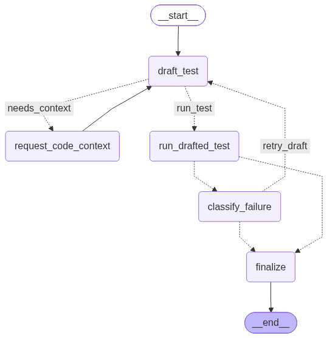

# Write One Scenario Agent

The per-scenario LangGraph subgraph that drafts, runs, and self-corrects a
single pytest test for one `Scenario`. It's compiled and driven once per
scenario by the outer [`codetest_writer_agent`](../README.md) -- this graph
has no notion of "the list of scenarios", only the one it was invoked for.

It never references `code_reader_agent` directly -- if a draft needs more
information about the target codebase, it asks for it by suspending the
graph with `langgraph.types.interrupt(...)`, and how that question gets
answered is entirely up to whatever is driving the graph (see the outer
README for the resume mechanics).

Graph (`graph.py`):

Per scenario:

1. `draft_test` -- structured LLM output (`DraftedTest`) either produces a
   complete pytest test file, or, if the code context so far is insufficient to
   ground it in the real implementation, sets `code_context_question` instead of
   guessing.
2. If a question was asked, `request_code_context` suspends the graph with
   `langgraph.types.interrupt(...)`. The caller's driver loop resumes it with
   an answer via `Command(resume=answer)`; this node then folds that answer
   into `code_context` and, if the answer names a file it can resolve, re-runs
   stdlib `ast` (`static_analysis.py`) to refresh `static_context`
   (signatures/docstrings/existing test files to reuse) before looping back to
   `draft_test`.
3. `run_drafted_test` first checks the draft against `guardrails.find_violations`
   -- a coarse keyword/pattern blocklist (filesystem deletion, network access,
   process/dynamic-code execution). If it matches, the draft is never written to
   disk or executed; the scenario goes straight to `finalize` as `blocked`.
   Otherwise it runs via `utils/pytest_runner.run_pytest_on_code`: a `subprocess` call
   to `python -m pytest`, using the target's own `.venv` interpreter if
   `root_dir` has a `uv`-managed one (`.venv/Scripts/python.exe` or
   `.venv/bin/python`), falling back to the agent's own `sys.executable`
   otherwise, in a scratch directory under the target `root_dir` (so the
   target's own `conftest.py`/fixtures resolve), always cleaned up afterwards.
4. On failure, `classify_failure` asks the LLM whether the bug is in the drafted
   test (retry, up to `max_attempts`) or in the source under test (stop and flag
   it in the report -- the loop never rewrites a test to dodge a real bug).
5. `finalize` records the outcome: `passed`, `flagged_source_bug`, `unresolved`,
   or `blocked`.

v1 scope: Python + pytest targets only, and execution isolation is subprocess +
scratch-dir + timeout, not a container. The target's own `uv`-managed `.venv`
is auto-detected and used when present; there is no explicit override config
yet.
