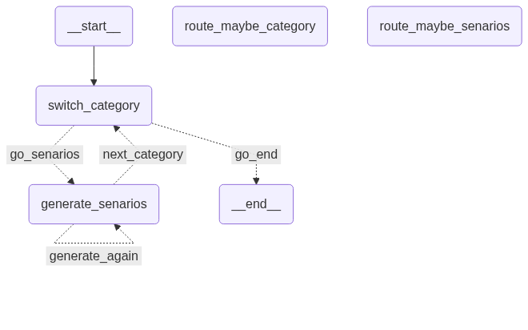

# Planner Agent

Turns a user story into a list of `Scenario`s, grouped by acceptance
criterion and category. This package is a logic wrapper: the actual
extraction and generation work happens in two subgraphs it drives,
[`extract_ac_agent`](extract_ac_agent/README.md) and
[`plann_one_ac_agent`](plann_one_ac_agent/README.md); `agent.py` compiles
each, sequences them, and handles the interrupt/resume plumbing and
incremental progress reporting.

The planning pipeline, step by step (`agent.py`):

1. Extract ACs -- `iter_planning_agent_steps` first runs the
   `extract_ac_agent` subgraph (see its [README](extract_ac_agent/README.md))
   to turn the story's `acceptance_criteria` into a list of `ac` strings. If
   the story didn't have any to extract, the LLM makes plausible ones up and
   the subgraph interrupts to ask a human to accept them, but there's no
   human on this call path, so `iter_planning_agent_steps` just auto-accepts
   whatever the LLM generated instead of blocking forever. `acs` then gets
   capped to `max_acs` if one was given.
2. Loop over ACs, then over categories -- this lives in `agent.py` as a plain
   Python double loop, not a graph node. For each `ac_idx`, and for each of
   `SCENARIO_CATEGORIES` (`"happy path"`, `"edge case"`, `"negative case"`),
   a fresh `PlannerAgentState` is built and streamed through
   `plann_one_ac_agent`'s compiled graph (see its
   [README](plann_one_ac_agent/README.md)) on its own new `thread_id`. The
   graph only ever handles the one `(ac, category)` pair it's given; the
   caller decides what comes next.
3. Stream progress and code-context questions -- as `plann_one_ac_agent`
   streams updates, each newly generated scenario is yielded immediately as
   `("progress", scenario)`, and any `code_context_question` interrupt is
   surfaced as `("question", text)` to whoever's driving
   `iter_planning_agent_steps` (the A2A executor, or a `code_context_resolver`
   passed to `invoke_planning_agent`), which resumes the graph with whatever
   answer comes back, up to `MAX_CODE_CONTEXT_ROUNDS` per category. Code
   context accumulated within an AC carries over across that AC's
   categories. `planner_agent` never calls `code_reader_agent` itself -- it
   only ever asks the question; answering it is the caller's job.
4. Done -- once every `(ac, category)` pair has been visited, `all_scenarios`
   is written out via `file_writer.write(...)` (a `BaseScenarioWriter`, see
   `write_markdown/`) and returned as the final result.

Entry points (`agent.py`):

- `invoke_planning_agent(llm, user_story, file_writer, output_dir, root_dir, max_acs=None, code_context_resolver=None)`
  -- blocking; resolves each `code_context_question` in-process via
  `code_context_resolver` (falling back to "No code context available." if
  none is given) and discards progress events.
- `iter_planning_agent_steps(llm, user_story, file_writer, output_dir, root_dir, max_acs=None)`
  -- generator form: yields `("question", text)` for each code-context
  question and `("progress", scenario)` as each scenario is generated,
  expecting the answer (or `None` for a progress ack) sent back via
  `.send()`. This lets a caller spanning multiple requests (an A2A executor)
  pause/resume at questions and push progress out incrementally. Returns the
  final `list[Scenario]` via `StopIteration.value`. `invoke_planning_agent`
  is just a thin blocking wrapper around this generator.

See [`extract_ac_agent/README.md`](extract_ac_agent/README.md) for how
acceptance criteria get extracted (or generated and human-reviewed), and
[`plann_one_ac_agent/README.md`](plann_one_ac_agent/README.md) for how
scenarios get generated for a single (ac, category) pair.
