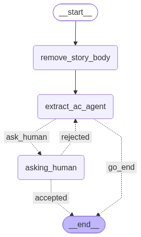

Extract AC agent:

Given a user story (passed in as read-only run context, not state — nodes never mutate it):
- llm tries to write acceptance criteria in a certain format (- a, - b, bullet point style), via a tool call (`extract_by_delimiter`) that regexes the bullets into a list of strings — keeps the output shape reliable instead of trusting the LLM to emit a list directly
- if acceptance criteria is found from input, then END, return the list of acceptance criteria (`acs`)
- if acceptance criteria is not found from the input (`NOT_FOUND_TOKEN`), the llm generates plausible criteria instead, then it should ask human if they accept this criteria (`asking_human` interrupt)
- if human accepts, then END
- if not, human feedback gets carried into the next extraction attempt, then run the agent again

Graph:

Files:
- `typed_schemas.py` — `ExtractACAgentState` (acs, human_accepted, human_feedback), `HumanReviewDecision`; `user_story` and `llm` live on `PlannerAgentContext` (`../typed_schemas.py`) instead, since they're read-only for this subgraph
- `nodes.py` — `should_ask_human`, `asking_human`, `route_after_human`
- `extract_dimiliter_agent.py` — the actual extraction agent + `extract_by_delimiter` tool
- `graph.py` — wires it all up, exports `builder` (uncompiled, for tests that need a checkpointer to resume interrupts) and `extract_ac_graph` (compiled, no checkpointer)
