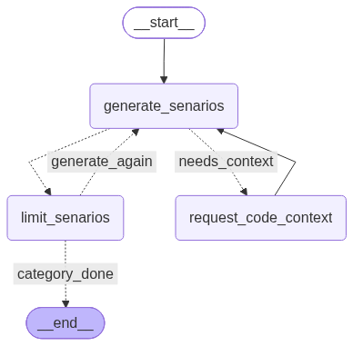

# Plan One AC Agent

The per-(AC, category) LangGraph subgraph that generates scenarios for a
single acceptance criterion and a single `SCENARIO_CATEGORIES` entry (`"happy
path"`, `"edge case"`, `"negative case"`). It's compiled once and streamed
by the outer [`planner_agent`](../README.md) in a plain Python double loop --
this graph has no notion of "the list of ACs" or "the list of categories",
only the one `(ac_idx, current_category)` pair it's given in
`PlannerAgentState`. There used to be a `switch_category` node meant to cycle
categories inside the graph itself; it's gone -- the caller decides what
(ac, category) pair comes next.

Graph (`graph.py`):

Per (ac, category):

1. `generate_senarios` -- structured LLM output (`ScenarioGenResult`, from
   `../typed_schemas.py`) either:
   - returns one `Scenario` for this category,
   - sets `is_category_covered` to true with no scenario if enough have
     already been generated for this (ac, category) (explaining why via
     `coverage_reasoning`), or
   - if the code context so far isn't enough to ground a scenario in the
     real implementation, leaves `scenario` null and sets
     `code_context_question` instead of guessing.

   `scenario_id`/`story_id`/`ac_id`/`category` are stamped onto the returned
   scenario by code, not trusted from the LLM, since traceability must be
   exact. The prompt is also fed the titles of scenarios already generated
   for this (ac, category) pair so it doesn't repeat itself.
2. If a question was asked, `request_code_context` suspends the graph with
   `langgraph.types.interrupt(...)`. The caller's driver loop resumes it with
   an answer via `Command(resume=answer)`; this node folds the answer into
   `code_context` (appending to whatever context already accumulated) before
   looping back to `generate_senarios`.
3. `limit_senarios` forces `is_category_covered` to true once
   `MAX_SCENARIOS_PER_CATEGORY` (3) scenarios exist for the current category,
   so a category can't loop forever even if the LLM keeps claiming it isn't
   covered yet.
4. `route_maybe_senarios` sends the graph back to `generate_senarios` if the
   category still isn't covered, or ends the graph (`category_done`)
   otherwise -- at which point the caller has the full scenario list for this
   (ac, category) pair and moves on to the next one.

Files:

- `graph.py` -- wires the nodes above into `builder` (uncompiled, so the
  caller can compile it with its own checkpointer to resume interrupts across
  requests) and `planner_agent_once_ac` (compiled, no checkpointer)
- `nodes/scenarios_generator.py` -- `generate_senarios`,
  `route_maybe_needs_context`, `route_maybe_senarios`
- `nodes/request_code_context.py` -- `request_code_context`
- `nodes/limit_senarios.py` -- `limit_senarios`, `MAX_SCENARIOS_PER_CATEGORY`
