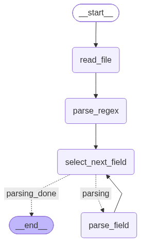

User story agent:

Given a `file_path` to a markdown user-story file and a `story_id`:
- reads the file into `story_body`
- regex-prefills whatever fields it can (`parse_re_story_file`), matching this project's `**Label:**` markdown convention
- for each field still missing (`name`, `description`, `test_description`, `acceptance_criteria`, `techinal_description`), asks the llm to extract it from `story_body`, one field at a time, looping until every field is filled or explicitly `not_found`
- END, return the filled `StoryAgentState`

Graph:

Files:
- `typed_schemas.py` — `StoryAgentState` (story_id, file_path, story_body, the five parsed fields, `parsing_field_name`), `StoryAgentContext` (llm), `AUTOMATIC_FILL_STORY_STATE` (fields to fill), `PROCESS_STATE`
- `tools/read_file.py` — reads the markdown file into a string
- `tools/parse_text_body.py` — `parse_re_story_file`, regex prefill for the `**Label:**` sections
- `nodes/parsing_nodes.py` — `read_file_node`, `parse_regex_prefill_node`, `parsing_single_field_node` (llm call per missing field, `not_found` token if absent)
- `nodes/select_node.py` — `select_next_field_node`/`route_after_select`, picks the next unfilled field or routes to `parsing_done`
- `subgraphs/parsing_graph.py` — wires it all up, exports `parsing_graph` (compiled)
- `agent.py` — `invoke_user_story_agent`, builds initial state/context and runs `parsing_graph`
- `agent_executor.py` — exposes the agent over A2A (`UserStoryAgentExecutor`), expects a data Part with `file_path`/`story_id`
- `__main__.py` — starts the A2A server (host/port from `config.py`)
